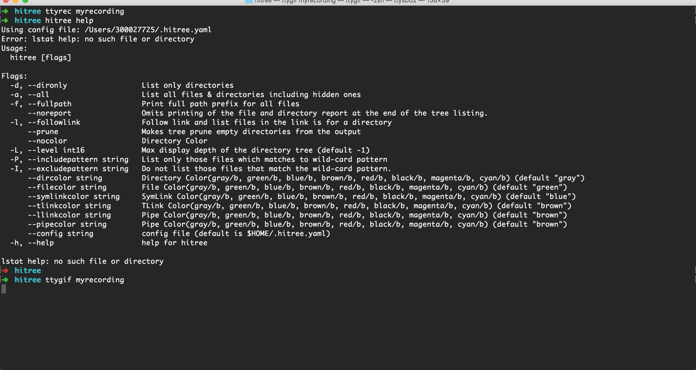

### HiTree - Tree Command For Mac

HiTree is a golang based implementation of popular linux tree command. This cameout as a learning exercise of golang. 

### Features

- Listing only directories
- Pruning empty directories
- Colored output
- Following Symlinks(if it is link to dir)
- Including / Excluding files based on regex
- Printing fullpath of the files
- Printing report - count of dir and files 
- Including / Excluding hidden files in result
- Controlling Max Level in the output

### Libraries Used

- Cobra & Viper (building CLI)
- Aurora (Coloring output)

### Usage

